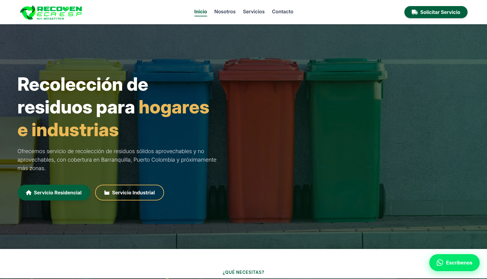

# ♻️ RECOVEN ECA SAS ESP — Landing Page Corporativa

¡Bienvenido al repositorio de la plataforma web de **RECOVEN**! Este proyecto es una landing page de producción de alto rendimiento diseñada para una Empresa de Servicios Públicos (ECA SAS ESP) enfocada en la economía circular y la gestión sostenible de residuos.

Desplegado en tiempo real en: 🚀 [landingpage-recoven.vercel.app](https://landingpage-recoven.vercel.app/index.html)

---

## 📸 Vista Previa del Proyecto

Aquí puedes ver la interfaz y el diseño visual de la plataforma:

---

## 🎯 Enfoque del Proyecto y Objetivos

El desarrollo se centró en balancear una **identidad corporativa institucional rigurosa** (esencial para el sector de servicios públicos ante entes de control y clientes industriales) con una **experiencia de usuario fluida y moderna**.

### Puntos Clave de la Interfaz:

- **Diseño Limpio y Profesional:** Estructura limpia basada en Tailwind CSS que transmite transparencia, seriedad y sostenibilidad ambiental.
- **Transparencia Institucional:** Inclusión detallada de aliados estratégicos identificados con sus respectivos NIT corporativos para generar confianza regulatoria inmediata.

---

## 🛠️ Arquitectura y Tecnologías Utilizadas

- **Vite:** Utilizado como entorno de empaquetado y construcción ultrarrápido para el frontend.
- **Vanilla JavaScript (ES6+):** Programación modular limpia, sin la sobrecarga ni el peso de frameworks innecesarios (Zero-Framework Architecture).
- **Tailwind CSS:** Sistema de diseño responsivo y optimizado para una maquetación ágil basada en utilidades.
- **Font Awesome:** Set de iconos vectoriales para la consistencia visual del sitio.

---

## ⚡ Decisiones Técnicas Clave y Optimización (Performance)

Este proyecto fue optimizado meticulosamente siguiendo las directrices de las **Core Web Vitals** de Google para garantizar una carga instantánea y respuestas en milisegundos:

### 1. Sistema de Carrusel Continuo Avanzado (Pure Drag & Swipe Edition)

En lugar de depender de librerías pesadas de terceros que saturan el hilo principal de renderizado, se desarrolló un módulo nativo (`carousel.js`) que implementa un loop matemático infinito por duplicación de arrays:

- **Aceleración por GPU:** Se hace uso de `requestAnimationFrame` manipulando exclusivamente la propiedad CSS `transform: translateX()`, apoyado por la directiva `will-change: transform`. Esto aísla el componente en su propia capa de renderizado nativa, evitando por completo procesos costosos de _Reflow_ y _Repaint_.
- **Física de Arrastre Fluida:** Soporte completo de gestos táctiles en dispositivos móviles (`touchstart`/`touchmove`) y eventos de ratón en escritorio (`mousedown`/`mousemove`), utilizando oyentes globales de `window` para erradicar el bug de desenganche del cursor.
- **Métricas Premium:** Gracias a esta arquitectura, el componente registra un **INP (Interaction to Next Paint) excepcional de solo 8 ms** y un **CLS (Cumulative Layout Shift) impecable de 0.05**.

### 2. Estrategia de Pre-renderizado contra el LCP

Para evitar penalizaciones en el _Largest Contentful Paint_ (LCP) causadas por la inyección asíncrona de JavaScript, los elementos iniciales del carrusel se encuentran embebidos directamente en el HTML estático. El script de hidratación clona y extiende el DOM en tiempo de ejecución, logrando un pintado inicial inmediato desde el primer milisegundo.

---

---

## ⚖️ Licencia y Propiedad Intelectual (Todos los Derechos Reservados)

Este repositorio es **público exclusivamente con fines de portafolio profesional y demostración técnica**.

El código fuente, diseño, lógica de componentes (incluyendo el sistema de carrusel continuo) e identidad visual pertenecen a **RECOVEN ECA SAS ESP** y al desarrollador autor. **No se otorga ninguna licencia de uso, copia, modificación o distribución comercial o privada.** Para más detalles sobre las restricciones legales y términos de propiedad, por favor consulta el archivo [LICENSE](./LICENSE) adjunto en la raíz de este proyecto. Cualquier réplica no autorizada será notificada y procesada legalmente.
